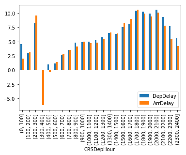

# RITA Flight Data Exploration
## Objective
This purpose of this notebook is to explore the flight data obtained from [stat-computing.org](http://stat-computing.org/dataexpo/2009/the-data.html) in search of an interesting visualization for my final Data Analyst Nanodegree project.


```python
# import necessary libraries
import pandas as pd
import matplotlib.pyplot as plt
import seaborn as sns
import pickle

%matplotlib inline
```

The data is separated by year. For simple exploration a single year will be chosen. 1988 was picked because it was one of the smallests data files that contained a full year of data.


```python
df = pd.read_csv('data/1988.csv.bz2', compression='bz2')
df.info()
df.sample(10)
```

    <class 'pandas.core.frame.DataFrame'>
    RangeIndex: 5202096 entries, 0 to 5202095
    Data columns (total 29 columns):
    Year                 int64
    Month                int64
    DayofMonth           int64
    DayOfWeek            int64
    DepTime              float64
    CRSDepTime           int64
    ArrTime              float64
    CRSArrTime           int64
    UniqueCarrier        object
    FlightNum            int64
    TailNum              float64
    ActualElapsedTime    float64
    CRSElapsedTime       int64
    AirTime              float64
    ArrDelay             float64
    DepDelay             float64
    Origin               object
    Dest                 object
    Distance             float64
    TaxiIn               float64
    TaxiOut              float64
    Cancelled            int64
    CancellationCode     float64
    Diverted             int64
    CarrierDelay         float64
    WeatherDelay         float64
    NASDelay             float64
    SecurityDelay        float64
    LateAircraftDelay    float64
    dtypes: float64(16), int64(10), object(3)
    memory usage: 1.1+ GB
    


<div>
<style scoped>
    .dataframe tbody tr th:only-of-type {
        vertical-align: middle;
    }

    .dataframe tbody tr th {
        vertical-align: top;
    }

    .dataframe thead th {
        text-align: right;
    }
</style>
<table border="1" class="dataframe">
  <thead>
    <tr style="text-align: right;">
      <th></th>
      <th>Year</th>
      <th>Month</th>
      <th>DayofMonth</th>
      <th>DayOfWeek</th>
      <th>DepTime</th>
      <th>CRSDepTime</th>
      <th>ArrTime</th>
      <th>CRSArrTime</th>
      <th>UniqueCarrier</th>
      <th>FlightNum</th>
      <th>...</th>
      <th>TaxiIn</th>
      <th>TaxiOut</th>
      <th>Cancelled</th>
      <th>CancellationCode</th>
      <th>Diverted</th>
      <th>CarrierDelay</th>
      <th>WeatherDelay</th>
      <th>NASDelay</th>
      <th>SecurityDelay</th>
      <th>LateAircraftDelay</th>
    </tr>
  </thead>
  <tbody>
    <tr>
      <th>1145466</th>
      <td>1988</td>
      <td>3</td>
      <td>5</td>
      <td>6</td>
      <td>1050.0</td>
      <td>1050</td>
      <td>1251.0</td>
      <td>1241</td>
      <td>DL</td>
      <td>1115</td>
      <td>...</td>
      <td>NaN</td>
      <td>NaN</td>
      <td>0</td>
      <td>NaN</td>
      <td>0</td>
      <td>NaN</td>
      <td>NaN</td>
      <td>NaN</td>
      <td>NaN</td>
      <td>NaN</td>
    </tr>
    <tr>
      <th>1284977</th>
      <td>1988</td>
      <td>3</td>
      <td>29</td>
      <td>2</td>
      <td>2044.0</td>
      <td>2035</td>
      <td>2224.0</td>
      <td>2200</td>
      <td>CO</td>
      <td>240</td>
      <td>...</td>
      <td>NaN</td>
      <td>NaN</td>
      <td>0</td>
      <td>NaN</td>
      <td>0</td>
      <td>NaN</td>
      <td>NaN</td>
      <td>NaN</td>
      <td>NaN</td>
      <td>NaN</td>
    </tr>
    <tr>
      <th>4572766</th>
      <td>1988</td>
      <td>11</td>
      <td>7</td>
      <td>1</td>
      <td>2222.0</td>
      <td>2222</td>
      <td>2329.0</td>
      <td>2330</td>
      <td>DL</td>
      <td>621</td>
      <td>...</td>
      <td>NaN</td>
      <td>NaN</td>
      <td>0</td>
      <td>NaN</td>
      <td>0</td>
      <td>NaN</td>
      <td>NaN</td>
      <td>NaN</td>
      <td>NaN</td>
      <td>NaN</td>
    </tr>
    <tr>
      <th>3045030</th>
      <td>1988</td>
      <td>8</td>
      <td>26</td>
      <td>5</td>
      <td>1059.0</td>
      <td>1059</td>
      <td>1127.0</td>
      <td>1129</td>
      <td>TW</td>
      <td>27</td>
      <td>...</td>
      <td>NaN</td>
      <td>NaN</td>
      <td>0</td>
      <td>NaN</td>
      <td>0</td>
      <td>NaN</td>
      <td>NaN</td>
      <td>NaN</td>
      <td>NaN</td>
      <td>NaN</td>
    </tr>
    <tr>
      <th>494412</th>
      <td>1988</td>
      <td>2</td>
      <td>8</td>
      <td>1</td>
      <td>1225.0</td>
      <td>1220</td>
      <td>1559.0</td>
      <td>1605</td>
      <td>UA</td>
      <td>554</td>
      <td>...</td>
      <td>NaN</td>
      <td>NaN</td>
      <td>0</td>
      <td>NaN</td>
      <td>0</td>
      <td>NaN</td>
      <td>NaN</td>
      <td>NaN</td>
      <td>NaN</td>
      <td>NaN</td>
    </tr>
    <tr>
      <th>3993042</th>
      <td>1988</td>
      <td>10</td>
      <td>6</td>
      <td>4</td>
      <td>1540.0</td>
      <td>1540</td>
      <td>1645.0</td>
      <td>1640</td>
      <td>WN</td>
      <td>162</td>
      <td>...</td>
      <td>NaN</td>
      <td>NaN</td>
      <td>0</td>
      <td>NaN</td>
      <td>0</td>
      <td>NaN</td>
      <td>NaN</td>
      <td>NaN</td>
      <td>NaN</td>
      <td>NaN</td>
    </tr>
    <tr>
      <th>2889837</th>
      <td>1988</td>
      <td>7</td>
      <td>25</td>
      <td>1</td>
      <td>650.0</td>
      <td>650</td>
      <td>745.0</td>
      <td>743</td>
      <td>DL</td>
      <td>921</td>
      <td>...</td>
      <td>NaN</td>
      <td>NaN</td>
      <td>0</td>
      <td>NaN</td>
      <td>0</td>
      <td>NaN</td>
      <td>NaN</td>
      <td>NaN</td>
      <td>NaN</td>
      <td>NaN</td>
    </tr>
    <tr>
      <th>331326</th>
      <td>1988</td>
      <td>1</td>
      <td>4</td>
      <td>1</td>
      <td>646.0</td>
      <td>645</td>
      <td>1148.0</td>
      <td>1204</td>
      <td>AA</td>
      <td>116</td>
      <td>...</td>
      <td>NaN</td>
      <td>NaN</td>
      <td>0</td>
      <td>NaN</td>
      <td>0</td>
      <td>NaN</td>
      <td>NaN</td>
      <td>NaN</td>
      <td>NaN</td>
      <td>NaN</td>
    </tr>
    <tr>
      <th>3632613</th>
      <td>1988</td>
      <td>9</td>
      <td>16</td>
      <td>5</td>
      <td>1200.0</td>
      <td>1200</td>
      <td>1330.0</td>
      <td>1335</td>
      <td>NW</td>
      <td>447</td>
      <td>...</td>
      <td>NaN</td>
      <td>NaN</td>
      <td>0</td>
      <td>NaN</td>
      <td>0</td>
      <td>NaN</td>
      <td>NaN</td>
      <td>NaN</td>
      <td>NaN</td>
      <td>NaN</td>
    </tr>
    <tr>
      <th>2768906</th>
      <td>1988</td>
      <td>7</td>
      <td>6</td>
      <td>3</td>
      <td>1245.0</td>
      <td>1245</td>
      <td>1330.0</td>
      <td>1340</td>
      <td>NW</td>
      <td>1019</td>
      <td>...</td>
      <td>NaN</td>
      <td>NaN</td>
      <td>0</td>
      <td>NaN</td>
      <td>0</td>
      <td>NaN</td>
      <td>NaN</td>
      <td>NaN</td>
      <td>NaN</td>
      <td>NaN</td>
    </tr>
  </tbody>
</table>
<p>10 rows × 29 columns</p>
</div>


A single year uses 1.1 GB of data. This can be alleviated by dropping unused columns and aggregating interesting information (e.g. computing averages by month and year).


```python
# Take a percentage sample to reduce the size
df = df.sample(frac=.01)
```

## Which Airlines have the longest delays


```python
carriers = pd.read_csv('data/carriers.csv')
carrier_dict = dict(carriers.values)
df.groupby('UniqueCarrier').agg({'DepDelay':'mean', 'ArrDelay':'mean'}) \
            .rename(index=carrier_dict) \
            .sort_values('DepDelay', ascending=False).plot.bar()
plt.show()
```


Continental was the worste airline for departures, while PanAm was the worst for arrivals.
It looks like some airlines have longer departure delays than arrival delays. 
### What is the relationship between arrival and departure delays?


```python
df.plot.scatter(x='DepDelay', y='ArrDelay')
plt.show()
```


```python
outliers = (((df.DepDelay - df.DepDelay.mean()).abs() > df.DepDelay.std()*3) | 
            ((df.ArrDelay - df.ArrDelay.mean()).abs() > df.ArrDelay.std()*3))
```


```python
sns.lmplot('DepDelay', 'ArrDelay', data=df[~outliers],
           fit_reg=False, hue='UniqueCarrier', scatter_kws={'alpha':0.3})
plt.show()
```


Even after trimming outliers and adding alpha, this chart is too busy.


```python
carrier_averages = df.groupby('UniqueCarrier').agg({'DepDelay':'mean', 'ArrDelay':'mean'}).reset_index()
sns.lmplot('DepDelay', 'ArrDelay', data=carrier_averages,
           fit_reg=False, hue='UniqueCarrier', )
plt.show()
```


After aggregating by airline it becomes too sparse and loses meaning.

## Delays by month


```python
df.groupby('Month').agg({'DepDelay':'mean', 'ArrDelay':'mean'}).plot.line()
plt.show()
```


```python
df.groupby('Month').agg({'DepDelay':'mean', 'ArrDelay':'mean'}).plot.bar()
plt.show()
```


September was the best month to fly, January the worst.

## What is the worst time of day to travel?


```python
df['CRSDepHour'] = pd.cut(df.CRSDepTime, list(range(0, 2500, 100)))
```


```python
df.groupby('CRSDepHour').agg({'DepDelay':'mean', 'ArrDelay':'mean'}).plot()
plt.show()
```


```python
df.groupby('CRSDepHour').agg({'DepDelay':'mean', 'ArrDelay':'mean'}).plot.bar()
plt.show()
```





Early morning is the best time to fly, with the delays increasing as the day goes on and peaking around 6pm.

### Distribution of Delays


```python
df.loc[:,['DepDelay', 'ArrDelay']].plot.density(xlim=(-50,100))
```


    <matplotlib.axes._subplots.AxesSubplot at 0x1efc8fe6f60>


```python
df.loc[:,['DepDelay', 'ArrDelay']].plot.box()
```


    <matplotlib.axes._subplots.AxesSubplot at 0x1ef963646d8>


### Which Airlines had the most delayed (>15 min) flights


```python
df.groupby(['Year', 'UniqueCarrier']).agg({'DepDelay':lambda x: (x>15).sum()/len(x)}).plot.bar()
plt.show()
```


## Data prepping
Carrier names are going to need some munging.


```python
carriers.loc[carriers.index.intersection(carriers.Description.str.len().nlargest(10).index)]
```


<div>
<style scoped>
    .dataframe tbody tr th:only-of-type {
        vertical-align: middle;
    }

    .dataframe tbody tr th {
        vertical-align: top;
    }

    .dataframe thead th {
        text-align: right;
    }
</style>
<table border="1" class="dataframe">
  <thead>
    <tr style="text-align: right;">
      <th></th>
      <th>Code</th>
      <th>Description</th>
    </tr>
  </thead>
  <tbody>
    <tr>
      <th>9</th>
      <td>0GQ</td>
      <td>Inter Island Airways, d/b/a Inter Island Air</td>
    </tr>
    <tr>
      <th>60</th>
      <td>6R</td>
      <td>Aerounion Aerotransporte de Carga Union SA de CV</td>
    </tr>
    <tr>
      <th>262</th>
      <td>B4</td>
      <td>Globespan Airways Limited d/b/a Flyglobespan</td>
    </tr>
    <tr>
      <th>642</th>
      <td>HP</td>
      <td>America West Airlines Inc. (Merged with US Air...</td>
    </tr>
    <tr>
      <th>690</th>
      <td>JAG</td>
      <td>JetAlliance Flugbetriebs d/b/a JAF Airservice</td>
    </tr>
    <tr>
      <th>720</th>
      <td>K3</td>
      <td>Venture Travel LLC d/b/a Taquan Air Service</td>
    </tr>
    <tr>
      <th>850</th>
      <td>MRQ</td>
      <td>National Air Cargo Group, Inc.d/b/a Murray Air</td>
    </tr>
    <tr>
      <th>1054</th>
      <td>QT</td>
      <td>Transportes Aereos Mercantiles Panamericanos S.A</td>
    </tr>
    <tr>
      <th>1308</th>
      <td>US</td>
      <td>US Airways Inc. (Merged with America West 9/05...</td>
    </tr>
    <tr>
      <th>1460</th>
      <td>YAT</td>
      <td>Friendship Airways, Inc. d/b/a Yellow Air Taxi</td>
    </tr>
  </tbody>
</table>
</div>


```python
# For simplicity, combine US Air and Amercia West
carriers.loc[[642, 1308], 'Description'] = 'US Airways'

# Drop doing business as (d/b/a) names
drop_dbas = lambda x: str.split(x, 'd/b/a')[0].strip()
carriers['Description'] = carriers['Description'].apply(drop_dbas)
```


```python
carriers.loc[carriers.index.intersection(carriers.Description.str.len().nlargest(10).index)]
```


<div>
<style scoped>
    .dataframe tbody tr th:only-of-type {
        vertical-align: middle;
    }

    .dataframe tbody tr th {
        vertical-align: top;
    }

    .dataframe thead th {
        text-align: right;
    }
</style>
<table border="1" class="dataframe">
  <thead>
    <tr style="text-align: right;">
      <th></th>
      <th>Code</th>
      <th>Description</th>
    </tr>
  </thead>
  <tbody>
    <tr>
      <th>8</th>
      <td>0FQ</td>
      <td>Maine Aviation Aircraft Charter, LLC</td>
    </tr>
    <tr>
      <th>60</th>
      <td>6R</td>
      <td>Aerounion Aerotransporte de Carga Union SA de CV</td>
    </tr>
    <tr>
      <th>270</th>
      <td>BAQ</td>
      <td>Aero Rentas De Coahuila S.A. De C.V.</td>
    </tr>
    <tr>
      <th>279</th>
      <td>BDQ</td>
      <td>Aerotaxis De Aguascalientes S.A. De C.V.</td>
    </tr>
    <tr>
      <th>294</th>
      <td>BIQ</td>
      <td>Servicios Aeronauticos Z S.A. De C.V.</td>
    </tr>
    <tr>
      <th>302</th>
      <td>BNQ</td>
      <td>Netjets Large Aircraft Company L.L.C.</td>
    </tr>
    <tr>
      <th>323</th>
      <td>C5</td>
      <td>Commutair Aka Champlain Enterprises, Inc.</td>
    </tr>
    <tr>
      <th>1031</th>
      <td>PU</td>
      <td>Primeras Lineas Uruguays For International</td>
    </tr>
    <tr>
      <th>1054</th>
      <td>QT</td>
      <td>Transportes Aereos Mercantiles Panamericanos S.A</td>
    </tr>
    <tr>
      <th>1459</th>
      <td>Y8</td>
      <td>Yangtze River Express Airlines Company</td>
    </tr>
  </tbody>
</table>
</div>


```python
df['UniqueCarrier'] = df['UniqueCarrier'].map(dict(carriers.values))
```


```python
df.UniqueCarrier.head()
```


    618384      Piedmont Aviation Inc.
    4868305     Southwest Airlines Co.
    1455876    Northwest Airlines Inc.
    4894209    Northwest Airlines Inc.
    4297444       Alaska Airlines Inc.
    Name: UniqueCarrier, dtype: object


```python
with open('data/carrier_dict.pkl', 'wb') as file:
    pickle.dump(dict(carriers.values), file)
```
